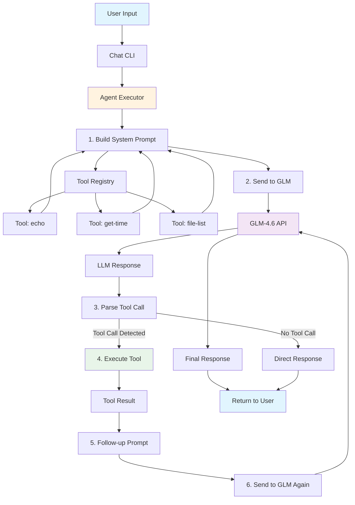

# Episode 4: Following a Message Through the Agent

## Introduction

In the first three episodes, I explained the individual components:
- Episode 1: The Tool System - how tools are defined
- Episode 2: Building Tools - implementing echo, get-time, file-list
- Episode 3: The Agent "Brain" - deciding when to use tools

But how do they all work together? Today I'll trace a complete message flow from start to finish.

When I first built this agent, I was surprised by how simple the architecture is. There's no complex state machine, no session management, no conversation history. Each message is processed independently.

**Timeline:** This took me about 3-4 hours to map out completely, including drawing the architecture diagram.

## Background

**What I knew before starting:**
- How each component works individually
- That the agent processes messages somehow
- That tools get executed when needed

**What I wanted to learn:**
- The complete message flow from input to output
- How data transforms at each step
- How all components connect
- What happens when things go wrong

**What I expected:**
Complex orchestration with multiple moving parts.

**What I found:**
A straightforward linear flow with clear separation of concerns.

## Architecture Overview

Here's the complete architecture:



**What this shows:**
- **Blue**: User interaction
- **Orange**: Agent orchestration
- **Purple**: LLM (GLM-4.6)
- **Green**: Tool execution
- **Blue**: Output back to user

## Deep Dive: Message Flow

Let's trace a complete message through the system. I'll use the example: **"What time is it?"**

### Step 0: User Input

```typescript
// User types in CLI
User: "What time is it?"
```

**Data format:** Plain text string

### Step 1: Build System Prompt

The agent starts by building a prompt that tells the LLM what tools are available:

```typescript
private buildSystemPrompt(): string {
  const toolDescriptions = this.tools
    .list()
    .map((tool) =>
      `- ${tool.name}: ${tool.description}\n  Parameters: ${JSON.stringify(tool.parameters)}`
    )
    .join("\n");

  return `You are a helpful AI assistant with access to the following tools:

${toolDescriptions}

When you need to use a tool, format your response as:
"Using tool: <tool_name> with params: <json_params>"

For example:
"Using tool: echo with params: {"message":"hello"}"

Always explain what you're doing before using a tool.`;
}
```

**What this generates:**
```
You are a helpful AI assistant with access to the following tools:

- echo: Echoes back the message you send. Useful for testing.
  Parameters: {"type":"object","properties":{"message":{"type":"string","description":"The message to echo back"}},"required":["message"]}

- get-time: Returns the current date and time in Beijing timezone (UTC+8)
  Parameters: {"type":"object","properties":{},"required":[]}

- file-list: Lists files in a directory. Recursively searches subdirectories by default.
  Parameters: {"type":"object","properties":{"directory":{"type":"string","description":"The directory to list files from"},"pattern":{"type":"string","description":"Optional glob pattern to filter files"},"recursive":{"type":"boolean","description":"Whether to search recursively (default: true)"},"hidden":{"type":"boolean","description":"Whether to include hidden files (default: false)"}},"required":[]}

When you need to use a tool, format your response as:
"Using tool: <tool_name> with params: <json_params>"

...
```

**Data transformation:** Tool objects → JSON Schema → Text description

### Step 2: Send to GLM

The agent combines the system prompt with the user's message:

```typescript
const prompt = `${systemPrompt}\n\nUser: ${message}\nAssistant:`;
const response = await this.llmClient.sendMessage(prompt);
```

**Full prompt sent to GLM:**
```
You are a helpful AI assistant with access to the following tools:
- echo: Echoes back the message you send...
- get-time: Returns the current date and time...
- file-list: Lists files in a directory...

When you need to use a tool, format your response as:
"Using tool: <tool_name> with params: <json_params>"

User: What time is it?
Assistant:
```

**Data transformation:** System prompt + user message → Single text prompt → HTTP POST to GLM API

### Step 3: GLM Responds

The GLM-4.6 API returns a response:

```json
{
  "choices": [
    {
      "message": {
        "role": "assistant",
        "content": "I'll check the current time for you. Using tool: get-time with params: {}"
      }
    }
  ]
}
```

**What the LLM "thought":**
1. User asked "What time is it?"
2. I have a `get-time` tool that returns time
3. I should use that tool
4. Format the response as instructed

**Data transformation:** JSON response → Extract `content` field → Text string

### Step 4: Parse Tool Call

The agent checks if the LLM wants to use a tool:

```typescript
const toolPattern = /Using tool:\s*([\w-]+)\s+with params:\s*(\{.*\})/i;
const match = response.content.match(toolPattern);

if (match) {
  const name = match[1];      // "get-time"
  const params = JSON.parse(match[2]);  // {}
  return { name, params };
}
```

**Parsing result:**
```javascript
{
  name: "get-time",
  params: {}
}
```

**Data transformation:** Text response → Regex match → Extract tool name and parameters → Parse JSON

### Step 5: Execute Tool

The agent calls the tool through the ToolRegistry:

```typescript
const toolResult = await this.tools.execute(toolCall.name, toolCall.params);
```

**Tool execution flow:**
```typescript
// In ToolRegistry.execute()
async execute<T, R>(name: string, params: T): Promise<R> {
  const tool = this.get(name);  // Find get-time tool
  return tool.execute(params);   // Call the tool
}

// In get-time tool
execute: async () => {
  const now = new Date();
  const beijingTime = new Date(now.getTime() + (8 * 60 * 60 * 1000));
  return beijingTime.toISOString().replace('Z', '') + ' (Beijing Time, UTC+8)';
}
```

**Tool result:**
```
"2026-02-21T09:45:13.123 (Beijing Time, UTC+8)"
```

**Data transformation:** Tool call → Function execution → Return value (string)

### Step 6: Follow-up Prompt

The agent sends the tool result back to the LLM with instructions:

```typescript
const followUpPrompt = `You just used the ${toolCall.name} tool and got this result: ${JSON.stringify(toolResult)}

Please provide a helpful, natural response to the user's question using this information.
Do NOT mention using a tool or repeat the tool call format. Just answer naturally.

User's question: ${message}`;
```

**Follow-up prompt:**
```
You just used the get-time tool and got this result: "2026-02-21T09:45:13.123 (Beijing Time, UTC+8)"

Please provide a helpful, natural response to the user's question using this information.
Do NOT mention using a tool or repeat the tool call format. Just answer naturally.

User's question: What time is it?
```

**Why this matters:** Without the "Do NOT mention using a tool" instruction, the LLM might say "I used the get-time tool and found out it's 9:45 AM" which sounds robotic.

### Step 7: Final Response

The LLM generates a natural response:

```json
{
  "choices": [
    {
      "message": {
        "role": "assistant",
        "content": "It's 9:45 AM on Saturday, February 21st, 2026."
      }
    }
  ]
}
```

**Data transformation:** JSON response → Extract content → Return to user

### Step 8: User Sees Result

```
User: What time is it?
Agent: It's 9:45 AM on Saturday, February 21st, 2026.
```

**Complete flow:** User input → Prompt → LLM → Tool execution → LLM → Natural response

## Data Transformation Summary

At each step, data transforms:

| Step | Input | Output | Transformation |
|------|-------|--------|----------------|
| 1. Build Prompt | Tool objects | Text prompt | Objects → JSON Schema → Text |
| 2. Send to GLM | Text prompt | HTTP request | Text → JSON body → POST |
| 3. GLM Responds | HTTP response | Text content | JSON → Extract field → String |
| 4. Parse Tool Call | Text string | Tool call object | Regex → Extract → Parse JSON |
| 5. Execute Tool | Tool call | Tool result | Function call → Return value |
| 6. Follow-up Prompt | Tool result | Text prompt | Value → JSON → Text template |
| 7. Final Response | HTTP response | Text content | JSON → Extract field → String |
| 8. Return to User | Text string | Displayed output | String → CLI output |

**Key insight:** Everything is text at the boundaries. JSON is used for structured data (tool calls, API responses), but the LLM communicates in plain text.

## Alternative Flow: No Tool Needed

What if the user asks something that doesn't require a tool?

**User:** "Hello!"

**Flow:**
```
User Input → Build Prompt → Send to GLM → LLM Responds → Parse Tool Call (none) → Return Direct Response
```

**LLM Response:**
```
"Hello! How can I help you today?"
```

**Parsing:**
```typescript
const toolCall = this.parseToolCall("Hello! How can I help you today?");
// Returns: undefined (no tool call)
```

**Result:** Direct response returned to user without tool execution.

**Timeline difference:**
- With tool: 2 LLM calls (~2-3 seconds)
- Without tool: 1 LLM call (~1 second)

## Component Responsibilities

Each component has a single, clear responsibility:

### **Tool Registry** (`src/agent/tools.ts`)
- **Responsibility:** Store and retrieve tools
- **Input:** Tool name, parameters
- **Output:** Tool result
- **Knows:** Nothing about LLMs or prompts

### **GLM Client** (`src/llm/glm.ts`)
- **Responsibility:** Send messages to GLM API
- **Input:** Text prompt
- **Output:** Text response
- **Knows:** Nothing about tools or agents

### **Agent Executor** (`src/agent/executor.ts`)
- **Responsibility:** Orchestrate the flow
- **Input:** User message
- **Output:** Final response
- **Knows:** How to connect GLM and tools

This separation of concerns makes the system easy to understand and test.

## What I Broke: Learning by Doing

### Experiment 1: What if message is empty?

**The code:**
```typescript
await executor.processMessage("");
```

**What happened:**
- GLM still responds: "Hello! How can I help you?"
- No errors, just a confused LLM

**What I learned:** The agent doesn't validate input. GLM handles empty messages gracefully. We could add validation, but **YAGNI** - the LLM handles it fine.

### Experiment 2: What if tool returns error?

**The code:**
```typescript
tools.register({
  name: "error-tool",
  execute: async () => {
    throw new Error("Tool failed!");
  }
});
```

**What happens:**
```typescript
try {
  const toolResult = await this.tools.execute(toolCall.name, toolCall.params);
} catch (error) {
  return `Error executing tool ${toolCall.name}: ${error instanceof Error ? error.message : "Unknown error"}`;
}
```

**User sees:** "Error executing tool error-tool: Tool failed!"

**What I learned:** Graceful error handling prevents the agent from crashing. The error message is clear but doesn't expose internal details.

### Experiment 3: What if LLM returns invalid JSON?

**The scenario:**
```
LLM: "Using tool: echo with params: {invalid json}"
```

**The code:**
```typescript
try {
  const params = JSON.parse(match[2]);
  return { name, params };
} catch {
  // Invalid JSON, return undefined
  return undefined;
}
```

**What happens:** Tool call ignored, raw LLM response returned to user.

**What I learned:** Graceful failure is better than crashing. The user sees a slightly awkward response instead of an error.

### Experiment 4: What if GLM API times out?

**The scenario:** GLM API doesn't respond within timeout.

**What happens:**
```typescript
// In glm.ts
const response = await fetch(this.baseURL, {
  // ...
  signal: AbortSignal.timeout(30000),  // 30 second timeout
});
```

**Error:** "Request timeout"

**What I learned:** Timeouts prevent hanging. 30 seconds is reasonable for LLM calls.

### Experiment 5: What if multiple tools needed?

**User:** "What time is it and echo hello world?"

**LLM Response:**
```
I'll help you with both. First, let me check the time. Using tool: get-time with params: {}
```

**What happens:** The LLM only calls one tool at a time. The user would need to ask a follow-up question.

**What I learned:** The current design doesn't support multiple tools in one message. The LLM could be instructed to call multiple tools, but we'd need to parse multiple tool calls and handle them in sequence.

## Key Takeaways

After tracing the complete message flow, here's what stuck:

1. **Everything is text at boundaries** - JSON is used internally, but LLM communicates in plain text

2. **No state = simplicity** - Each message is independent. No session management needed

3. **Clear separation of concerns** - Each component has one job: tools execute, LLM thinks, agent orchestrates

4. **Two-phase communication is natural** - Decision → Execution → Response mirrors how humans think

5. **Graceful error handling is essential** - Tools fail, LLMs time out, but the agent keeps running

6. **The LLM interprets everything** - Tool results are just text. The LLM turns structured data into natural language

7. **Prompt engineering matters** - The "Do NOT mention using a tool" instruction prevents awkward responses

## What Surprised Me

1. **How linear the flow is** - No complex branching, just a straight line through the system

2. **No conversation memory** - Each message is standalone. The LLM gets context from the prompt, not from stored history

3. **Text-based communication is flexible** - We don't need structured protocols. Plain text works fine

4. **Error handling is simple** - Just try/catch blocks. No complex retry or recovery logic needed

5. **The follow-up prompt is crucial** - Without clear instructions, LLM responses are awkward

6. **Tool results are opaque to the agent** - The executor doesn't inspect tool results. It just passes them to the LLM

7. **Two LLM calls are fast** - Even with tool execution, the whole flow takes 2-3 seconds

## Testing the Complete Flow

**Integration test for simple message:**
```typescript
it("processes message without tool", async () => {
  mockGLMClient.sendMessage.mockResolvedValue({
    content: "Hello! How can I help you?"
  });

  const response = await executor.processMessage("Hello!");
  expect(response).toBe("Hello! How can I help you?");
  expect(mockGLMClient.sendMessage).toHaveBeenCalledTimes(1);
});
```

**Integration test for tool call:**
```typescript
it("processes message with tool call", async () => {
  mockGLMClient.sendMessage
    .mockResolvedValueOnce({
      content: 'Using tool: get-time with params: {}'
    })
    .mockResolvedValueOnce({
      content: 'It is currently 9:45 AM.'
    });

  const response = await executor.processMessage("What time is it?");
  expect(response).toContain("9:45 AM");
  expect(mockGLMClient.sendMessage).toHaveBeenCalledTimes(2);
});
```

**Integration test for error handling:**
```typescript
it("handles tool execution errors", async () => {
  tools.register({
    name: "error-tool",
    execute: async () => { throw new Error("Failed!"); }
  });

  mockGLMClient.sendMessage.mockResolvedValue({
    content: 'Using tool: error-tool with params: {}'
  });

  const response = await executor.processMessage("Use error tool");
  expect(response).toContain("Error executing tool");
});
```

## Code Evolution: What Changed

**Initial thought:** Store conversation history for context
**Final code:** No state, each message is independent
**Why?** Simpler. GLM-4.6 is smart enough to understand from the prompt alone.

**Initial thought:** Complex tool call protocol (JSON format)
**Final code:** Simple text format "Using tool: X with params: Y"
**Why?** Easier to debug. Text is transparent and flexible.

**Initial thought:** Multiple tools in one message
**Final code:** One tool per message
**Why?** Simpler to implement. Can be extended later if needed.

**Initial thought:** Tool result validation
**Final code:** Pass tool results directly to LLM
**Why?** The LLM is smart enough to interpret tool results. Validation would be YAGNI.

## Next Steps

Now that we've traced the complete flow and understand the architecture:

**Episode 5 Preview:** LLM Integration - deep dive into:
- GLM client implementation
- API integration patterns
- Error handling strategies
- Custom base URL support
- Timeout configuration

We'll explore how the GLM client connects to the API and handles all the edge cases.

## Resources

- **Code:**
  - `src/agent/executor.ts` - Agent orchestration
  - `src/agent/tools.ts` - Tool registry
  - `src/llm/glm.ts` - GLM client
- **Tests:**
  - `src/agent/executor-integration.test.ts` - End-to-end tests
- **Previous Episodes:**
  - [Episode 1: Tool System](episode-1-tool-system.md)
  - [Episode 2: Building Tools](episode-2-building-tools.md)
  - [Episode 3: Agent "Brain"](episode-3-agent-brain.md)

---

**Previous:** [Episode 3: Agent "Brain"] | **Next:** [Episode 5: LLM Integration]
