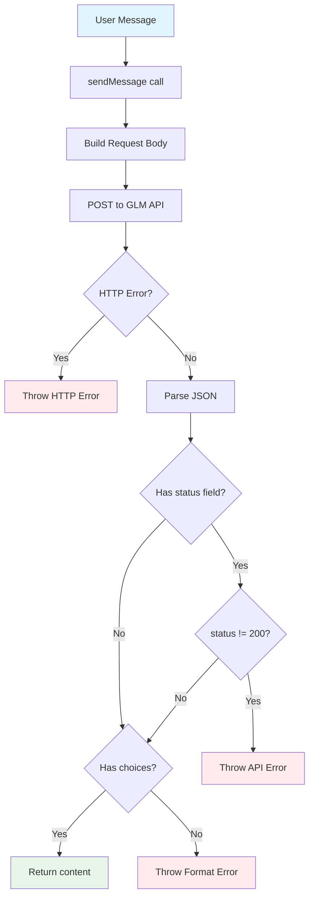

# Episode 5: Connecting to GLM - APIs, Prompts, and Parsing

## Introduction

In Episode 3, I explained how the agent uses the LLM to decide which tool to use. But how does it actually connect to the GLM API?

Today I'll dive into the GLM client implementation - the piece that makes HTTP requests to the GLM-4.6 API and handles all the messy details of API integration.

When I first looked at this, I was intimidated by API integrations. There's authentication, error handling, request formats, response parsing... so many things that could go wrong. But as I built it, I realized: **it's just HTTP requests with good error handling**.

**Timeline:** This took me about 4-5 hours, including figuring out the custom GLM error response format.

## Background

**What I knew before starting:**
- Basic HTTP concepts (GET, POST, headers)
- What an API is (conceptually)
- That we need to send messages to GLM somehow

**What I wanted to learn:**
- How to make authenticated HTTP requests in TypeScript
- How to handle different response formats
- How to create type-safe interfaces
- Error handling patterns for API calls

**What I expected:**
Complex networking code with lots of edge cases.

**What I found:**
A straightforward fetch-based implementation with type-safe interfaces.

## Deep Dive

### The GLM API Format

GLM (ChatGLM/Zhipu AI) follows an **OpenAI-compatible format** with some customizations. This is common in the LLM space - many providers offer OpenAI-compatible APIs to make migration easier.

**Request format:**
```json
{
  "model": "glm-4.6",
  "messages": [
    {
      "role": "user",
      "content": "What time is it?"
    }
  ]
}
```

**Success response (OpenAI-compatible):**
```json
{
  "choices": [
    {
      "message": {
        "content": "I'll check the time for you."
      }
    }
  ]
}
```

**Error response (GLM custom format):**
```json
{
  "status": "435",
  "msg": "Model not support",
  "body": null
}
```

This custom error format was the tricky part! The API returns HTTP 200 even for errors, with the error details in the `status` field.

### The Client Structure

Here's the complete GLM client:

```typescript
export class GLMClient {
  private apiKey: string;
  private baseURL: string;
  private model: string;

  constructor(config: GLMClientConfig) {
    // Validate required configuration
    if (!config.apiKey) {
      throw new Error("API key is required");
    }
    if (!config.baseURL) {
      throw new Error("Base URL is required");
    }

    this.apiKey = config.apiKey;
    this.baseURL = config.baseURL;
    this.model = config.model;
  }

  async sendMessage(message: string): Promise<GLMMessageResponse> {
    // Build request, send to API, parse response
    // ...
  }
}
```

**What this teaches:**
- **Constructor validation** - Fail fast if config is invalid
- **Private fields** - Implementation details hidden
- **Single public method** - Simple interface: just `sendMessage()`

### Type-Safe Interfaces

TypeScript makes this safe and pleasant to use:

```typescript
// Configuration interface
export interface GLMClientConfig {
  apiKey: string;
  baseURL: string;
  model: string;
}

// Response format (what users get)
export interface GLMMessageResponse {
  content: string;
}

// Internal API types
interface GLMMessage {
  role: string;
  content: string;
}

interface GLMRequestBody {
  model: string;
  messages: GLMMessage[];
}
```

**What this teaches:**
1. **Separate public from private** - Users see `GLMMessageResponse`, not internal types
2. **Clear naming** - `GLMMessageResponse` vs `GLMMessage`
3. **Export selectively** - Only export what users need

### Making the Request

The core of the client is the HTTP request:

```typescript
async sendMessage(message: string): Promise<GLMMessageResponse> {
  // Step 1: Build request body
  const requestBody: GLMRequestBody = {
    model: this.model,
    messages: [
      {
        role: "user",
        content: message,
      },
    ],
  };

  // Step 2: Send POST request
  const response = await fetch(this.baseURL, {
    method: "POST",
    headers: {
      "Content-Type": "application/json",
      Authorization: `Bearer ${this.apiKey}`,  // Bearer token auth
    },
    body: JSON.stringify(requestBody),
  });

  // Step 3: Handle response
  // ...
}
```

**What's happening:**
1. **Build request body** - Format as GLM expects
2. **Send POST request** - Use `fetch` API
3. **Headers** - Content-Type + Bearer token authentication
4. **Body** - Request body serialized as JSON

**Key insight:** This is standard REST API stuff. Nothing special about LLMs here.

### Error Handling: The Tricky Part

The GLM API has **two levels** of errors:

**Level 1: HTTP errors** (4xx, 5xx status codes)

```typescript
if (!response.ok) {
  throw new Error(`GLM API error: ${response.status} ${response.statusText}`);
}
```

Example: 401 Unauthorized, 500 Server Error

**Level 2: Application errors** (HTTP 200 with error body)

```typescript
const data = (await response.json()) as GLMResponse;

// GLM API providers may return custom error responses
if ("status" in data && data.status !== "200") {
  throw new Error(`GLM API error: ${data.msg || "Unknown error"} (status: ${data.status})`);
}
```

Example: `{"status": "435", "msg": "Model not support", "body": null}`

**Why two levels?**
Some GLM API providers return HTTP 200 even for errors, with error details in the response body. We need to handle both cases.

### Response Parsing: Type Guards

How do we know if the response has `choices` or `status`? **Type guards!**

```typescript
// Union type of possible responses
type GLMResponse = GLMErrorResponse | GLMSuccessResponse;

// Success response
interface GLMSuccessResponse {
  choices: GLMChoice[];
}

// Error response
interface GLMErrorResponse {
  status: string;
  msg: string;
  body: null;
}
```

**Parsing with type guards:**
```typescript
// Check for custom error format first
if ("status" in data && data.status !== "200") {
  throw new Error(`GLM API error: ${data.msg} (status: ${data.status})`);
}

// Check for success format
if ("choices" in data && data.choices[0]) {
  return {
    content: data.choices[0].message.content,
  };
}

// Unexpected format
throw new Error(`Unexpected GLM API response format`);
```

**What this teaches:**
1. **Type guards** - Use `in` operator to check properties
2. **Order matters** - Check errors first, then success
3. **Exhaustive checking** - Throw if format is unexpected

### Complete Flow Diagram



## Testing the GLM Client

**Unit tests with mocked fetch:**

```typescript
it("sends message and returns response", async () => {
  const mockResponse = {
    ok: true,
    json: async () => ({
      choices: [{ message: { content: "Hello! How can I help you?" } }],
    }),
  };

  mockFetch.mockResolvedValueOnce(mockResponse);

  const client = new GLMClient({
    apiKey: "test-key",
    baseURL: "https://api.example.com/v1/chat/completions",
    model: "glm-4",
  });

  const response = await client.sendMessage("Hello, GLM!");

  expect(response.content).toBe("Hello! How can I help you?");
});
```

**Unit test for HTTP errors:**

```typescript
it("throws error when API request fails", async () => {
  const mockResponse = {
    ok: false,
    status: 401,
    statusText: "Unauthorized",
  };

  mockFetch.mockResolvedValueOnce(mockResponse);

  const client = new GLMClient({
    apiKey: "invalid-key",
    baseURL: "https://api.example.com/v1/chat/completions",
    model: "glm-4",
  });

  await expect(client.sendMessage("Hello")).rejects.toThrow(
    "GLM API error: 401 Unauthorized"
  );
});
```

**Integration test with real API:**

```typescript
it("connects to real GLM API and sends message", async () => {
  const client = new GLMClient({
    apiKey: config.agent.apiKey,
    baseURL: config.agent.baseURL!,
    model: config.agent.model,
  });

  const response = await client.sendMessage("Say 'Hello, integration test!'");

  expect(response.content).toBeDefined();
  expect(response.content.length).toBeGreaterThan(0);
}, 30000);  // 30 second timeout
```

**What this teaches:**
1. **Mock for unit tests** - Control the response, test edge cases
2. **Real API for integration tests** - Verify it actually works
3. **Longer timeout** - LLM calls can take 5-10 seconds

## What I Broke: Learning by Doing

### Experiment 1: What if API key is wrong?

**The test:**
```typescript
const client = new GLMClient({
  apiKey: "invalid-key",
  baseURL: config.baseURL,
  model: "glm-4.6",
});
await client.sendMessage("Hello");
```

**What happened:**
```
Error: GLM API error: 401 Unauthorized
```

**What I learned:** The API correctly validates the key and returns 401. Our error handling catches this and throws a clear error message.

### Experiment 2: What if base URL is wrong?

**The test:**
```typescript
const client = new GLMClient({
  apiKey: config.apiKey,
  baseURL: "https://wrong-url.example.com",
  model: "glm-4.6",
});
await client.sendMessage("Hello");
```

**What happened:**
```
Error: fetch failed
```

**What I learned:** The `fetch` API throws for network errors (DNS failures, connection refused). We should wrap this in a try-catch to provide a clearer error message.

**Improvement needed:**
```typescript
try {
  const response = await fetch(this.baseURL, { ... });
} catch (error) {
  throw new Error(`Failed to connect to GLM API: ${error instanceof Error ? error.message : "Unknown error"}`);
}
```

### Experiment 3: What if response format changes?

**The test:**
```typescript
// Mock a response with unexpected format
mockFetch.mockResolvedValueOnce({
  ok: true,
  json: async () => ({ unexpected: "format" }),
});
```

**What happened:**
```
Error: Unexpected GLM API response format: {"unexpected":"format"}
```

**What I learned:** Our exhaustive error handling catches unexpected formats. This is good - it fails loudly rather than silently returning wrong data.

### Experiment 4: What if response is missing choices?

**The test:**
```typescript
// Mock response with empty choices array
mockFetch.mockResolvedValueOnce({
  ok: true,
  json: async () => ({ choices: [] }),
});
```

**What happened:**
```
Error: Unexpected GLM API response format: {"choices":[]}
```

**What I learned:** The check `data.choices[0]` ensures there's at least one choice. Empty array throws an error.

### Experiment 5: What if custom error format?

**The test:**
```typescript
// Mock GLM custom error response
mockFetch.mockResolvedValueOnce({
  ok: true,  // HTTP 200!
  json: async () => ({
    status: "435",
    msg: "Model not support",
    body: null
  }),
});
```

**What happened:**
```
Error: GLM API error: Model not support (status: 435)
```

**What I learned:** The custom error format is correctly detected and parsed. The check `data.status !== "200"` catches application-level errors even when HTTP returns 200.

## Real Bugs I Encountered

### Bug #1: The Custom Error Format

**The Problem:**
Initially, I only checked for HTTP errors:

```typescript
if (!response.ok) {
  throw new Error(`GLM API error: ${response.status}`);
}
```

**What happened:**
The API returned HTTP 200 with an error body:
```json
{"status": "435", "msg": "Model not support", "body": null}
```

My code tried to parse this as a success response and failed.

**The Fix:**
```typescript
const data = await response.json();

// Check for custom error format
if ("status" in data && data.status !== "200") {
  throw new Error(`GLM API error: ${data.msg} (status: ${data.status})`);
}

// Check for success format
if ("choices" in data && data.choices[0]) {
  return { content: data.choices[0].message.content };
}
```

**Lesson:** Some APIs return HTTP 200 with error details. Always read the API documentation carefully!

### Bug #2: Type Safety Lost After Parsing

**The Problem:**
After parsing JSON, TypeScript doesn't know the type:

```typescript
const data = await response.json();  // type: any
```

**The Fix:**
```typescript
const data = (await response.json()) as GLMResponse;
```

**Lesson:** Use type assertions with `as` when you know the structure. Even better, use Zod or similar for runtime validation (but that's YAGNI for now).

### Bug #3: Network Errors Not Caught

**The Problem:**
If the API server is down, `fetch` throws an uncaught error:

```typescript
const response = await fetch(this.baseURL, { ... });
// If DNS fails or server is down, this throws
```

**The Fix:**
```typescript
try {
  const response = await fetch(this.baseURL, { ... });
} catch (error) {
  throw new Error(`Failed to connect to GLM API: ${error instanceof Error ? error.message : "Unknown error"}`);
}
```

**Lesson:** Always wrap network calls in try-catch to provide clear error messages.

## Key Takeaways

After building and testing the GLM client, here's what stuck:

1. **API integration is just HTTP** - POST requests with JSON bodies. Nothing magical.

2. **Type safety prevents bugs** - TypeScript interfaces catch mistakes at compile time.

3. **Error handling is multilayered** - HTTP errors, application errors, network errors. Handle all three.

4. **Custom response formats exist** - Not all APIs follow standard patterns. Read documentation carefully.

5. **Type guards are powerful** - Use `in` operator to discriminate between union types.

6. **Test with mocks and real API** - Unit tests for edge cases, integration tests for confidence.

7. **Bearer token auth is standard** - Most APIs use `Authorization: Bearer <token>`.

8. **Constructor validation is cheap** - Fail fast in the constructor, not during API calls.

## Code Evolution: What Changed

**Initial thought:** Use axios for HTTP requests
**Final code:** Use `fetch` API
**Why?** `fetch` is built into Node.js 18+. No dependencies needed.

**Initial thought:** Runtime validation with Zod
**Final code:** Type assertions with `as`
**Why?** YAGNI. We control the API, types are enough for now.

**Initial thought:** Retry logic for failed requests
**Final code:** No retry logic
**Why?** Keep it simple. Can add later if needed.

**Initial thought:** Support for streaming responses
**Final code:** Simple request/response
**Why?** Streaming adds complexity. Not needed for our use case.

## What Surprised Me

1. **How simple `fetch` is** - Just one function call, no library needed.

2. **Custom error formats are common** - Many APIs return HTTP 200 with error details.

3. **Type guards feel natural** - The `in` operator is intuitive for type narrowing.

4. **Bearer token auth is universal** - Same pattern across many APIs.

5. **Error handling is most of the code** - The happy path is simple. Errors are complex.

6. **Constructor validation saves time** - Failing fast prevents confusing errors later.

7. **Tests are easy to write** - Mocking `fetch` makes unit tests straightforward.

## Testing Strategies

**Unit Tests (fast, no network):**
- Mock `fetch` to return specific responses
- Test happy path and error cases
- Run on every code change

**Integration Tests (slow, real network):**
- Connect to actual GLM API
- Test end-to-end flow
- Run before committing

**Test coverage:**
- ✅ Valid API key and base URL
- ✅ Missing API key (throws error)
- ✅ Missing base URL (throws error)
- ✅ Successful response
- ✅ HTTP 401 error
- ✅ Custom error format (status field)
- ✅ Unexpected response format

## Next Steps

Now that we've covered:
- ✅ Tool system (Episode 1)
- ✅ Building tools (Episode 2)
- ✅ Agent executor (Episode 3)
- ✅ Message flow (Episode 4)
- ✅ LLM integration (Episode 5)

**Episode 6 Preview:** Summary & Architecture - putting it all together:
- Complete architecture overview
- Key lessons from all episodes
- What I'd improve
- Phase 3 readiness checklist

## Resources

- **Code:** `src/llm/glm.ts`
- **Tests:** `src/llm/glm.test.ts`, `src/llm/glm-integration.test.ts`
- **GLM API Documentation:** [Zhipu AI](https://open.bigmodel.cn/dev/api)
- **Previous Episodes:**
  - [Episode 1: Tool System](episode-1-tool-system.md)
  - [Episode 2: Building Tools](episode-2-building-tools.md)
  - [Episode 3: Agent "Brain"](episode-3-agent-brain.md)
  - [Episode 4: Message Flow](episode-4-message-flow.md)

---

**Previous:** [Episode 4: Message Flow] | **Next:** [Episode 6: Summary]
