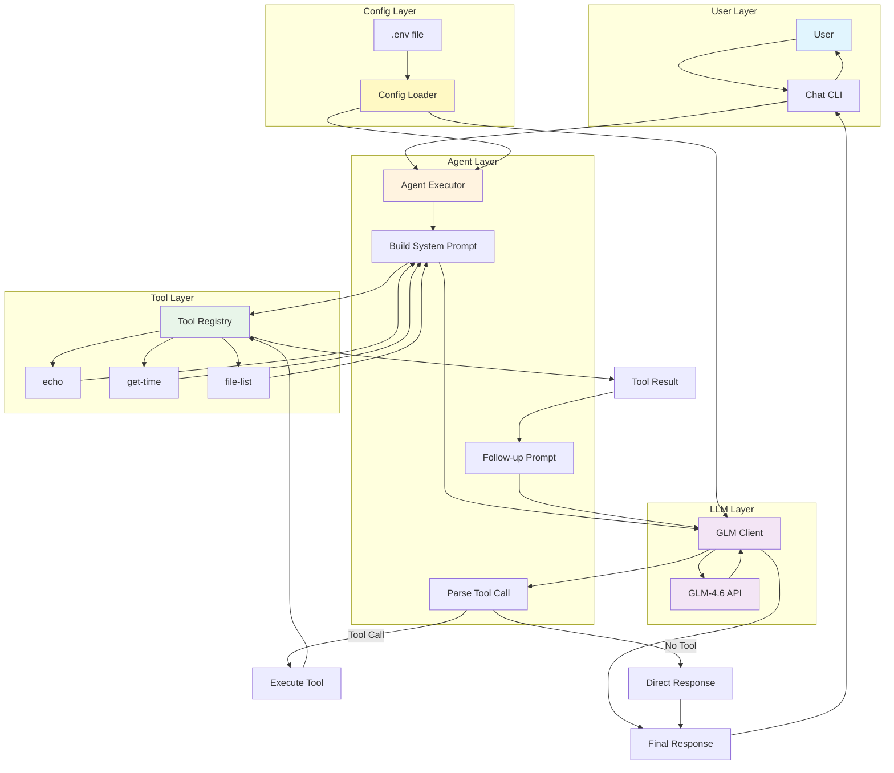

# Episode 6: Building an AI Agent - What I Learned

## Introduction

This is the final episode of Phase 2. Over the past 5 episodes, I've explained how our AI agent works, from the tool system to the GLM integration.

Today I'll reflect on the entire journey: what I learned, what surprised me, and what I'd do differently. I'll also create a complete architecture diagram and prepare for Phase 3 - rebuilding everything from scratch.

**Timeline:** Phase 2 took about 20-25 hours total over 6 days, including writing and revising all blog posts.

## Background

**What I knew before Phase 2:**
- I had built a working agent (Phase 1)
- I could run the code and tests
- I had a basic understanding of TypeScript

**What I wanted to learn:**
- Could I explain each component without looking at the code?
- Could I draw the architecture from memory?
- Do I understand the TypeScript concepts used?
- Could I rebuild this from scratch?

**What I expected:**
Detailed technical documentation.

**What I found:**
Writing blog posts forced me to understand deeply. The Feynman technique works!

## Complete Architecture

Here's the complete architecture with all components:



## Component Summary

| Component | File | Lines of Code | Responsibility | Key TypeScript Concepts |
|-----------|------|---------------|----------------|------------------------|
| **Tool Interface** | `src/agent/tools.ts` | ~40 | Define tool contract | Generics `<T, R>`, interfaces |
| **Tool Registry** | `src/agent/tools.ts` | ~70 | Store and execute tools | Map, generic methods, async/await |
| **Built-in Tools** | `src/agent/built-in-tools.ts` | ~200 | Example implementations | Type parameters, async functions, error handling |
| **Agent Executor** | `src/agent/executor.ts` | ~160 | Orchestrate message flow | Regex, error handling, template strings |
| **GLM Client** | `src/llm/glm.ts` | ~200 | Connect to GLM API | Fetch API, type guards, interfaces |
| **Config Loader** | `src/config/load.ts` | ~60 | Load configuration | Type assertions, dotenv |
| **Chat CLI** | `src/cli/chat.ts` | ~80 | Interactive interface | Readline, async/await |
| **Total** | - | **~810** | - | - |

**Key insight:** The entire agent is less than 1000 lines of code. Simplicity wins!

## Key Lessons by Episode

### **Episode 1: Tool System**
**Biggest lesson:** Generics aren't scary - they're clarity.

Before this project, I thought generics were complex. Now I see them as type placeholders that make code safer and easier to understand.

**What stuck:**
- `Tool<T, R>` means "takes type T, returns type R"
- TypeScript catches bugs at compile time, not runtime
- The Map is perfect for registries

### **Episode 2: Building Tools**
**Biggest lesson:** Start simple, then evolve.

The echo tool was just 5 lines, but it taught me the pattern. The file-list tool started broken (only top-level) and evolved through testing.

**What stuck:**
- YAGNI (You Aren't Gonna Need It) - keep it simple
- Timezones are confusing - always be explicit
- Recursion requires care - track base directory correctly
- Pattern matching is subtle - test with real data

### **Episode 3: Agent "Brain"**
**Biggest lesson:** The agent doesn't "know" anything.

The intelligence comes entirely from the LLM. The agent just coordinates. This was surprising - I expected complex decision logic.

**What stuck:**
- Two-phase communication: Decision → Execution → Response
- No state = simplicity (each message is independent)
- The follow-up prompt is crucial for natural responses
- Regex is fragile - test with real data

### **Episode 4: Message Flow**
**Biggest lesson:** Everything is text at boundaries.

JSON is used internally, but the LLM communicates in plain text. Tool results are just text that the LLM interprets.

**What stuck:**
- Linear flow with clear separation of concerns
- Data transforms at each step (objects → JSON → text)
- Tool results are opaque to the agent (just passed to LLM)
- Two LLM calls take 2-3 seconds total

### **Episode 5: LLM Integration**
**Biggest lesson:** API integration is just HTTP.

There's nothing magical about LLM APIs - they're just REST endpoints with JSON. The tricky part is error handling.

**What stuck:**
- Custom error formats exist (HTTP 200 with error body)
- Type guards use `in` operator for discrimination
- Bearer token auth is universal
- Error handling is most of the code

## What Surprised Me Overall

### 1. **How Little Code is Needed**
The entire agent is ~810 lines. I expected thousands. The secret: **simple patterns, no over-engineering**.

### 2. **No Conversation Memory**
Each message is processed independently. The LLM gets context from the prompt, not from stored history. This makes the agent stateless and simple.

### 3. **TypeScript Makes Learning Easier**
I was intimidated by TypeScript, but the type system caught so many bugs that I learned faster. Types are documentation that never gets outdated.

### 4. **Testing is Fun**
Seeing tests pass gives immediate satisfaction. TDD (Test-Driven Development) actually worked - I understood the interface before implementing.

### 5. **Bugs Were Teaching Moments**
Each bug taught me more than writing perfect code:
- Regex hyphen bug → Test with real data
- Timezone bug → Always consider timezone
- File-list bug → Think about directory structures
- Custom error format → Read API docs carefully

### 6. **Writing Forces Understanding**
I didn't truly understand a component until I wrote about it. The Feynman technique is real: teaching reinforces learning.

### 7. **TDD Actually Prevented Over-Engineering**
Writing tests first meant I only implemented what was needed. No "just in case" features. YAGNI in action.

## Key TypeScript Concepts Learned

| Concept | Where Used | Why It Matters |
|---------|-----------|----------------|
| **Generics** | `Tool<T, R>` | Type-safe tools without code duplication |
| **Interfaces** | All components | Clear contracts between components |
| **Type Guards** | GLM response parsing | Discriminate between union types safely |
| **Async/Await** | All I/O operations | Clean asynchronous code |
| **Map** | Tool Registry | Efficient key-value storage |
| **Template Strings** | Prompt building | Easy string interpolation |
| **Union Types** | GLM responses | Model multiple response formats |
| **Type Assertions** | JSON parsing | Tell TypeScript the type when we know better |

## What I'd Do Differently

### **Design Decisions I'd Keep:**
✅ Simple tool interface (4 fields)
✅ Map-based registry
✅ Text-based tool call format
✅ No conversation state
✅ Two-phase communication
✅ Bearer token authentication

### **What I'd Change:**

**1. Add Request Timeout**
```typescript
const response = await fetch(this.baseURL, {
  // ...
  signal: AbortSignal.timeout(30000),  // 30 second timeout
});
```

**2. Wrap Network Errors**
```typescript
try {
  const response = await fetch(this.baseURL, { ... });
} catch (error) {
  throw new Error(`Failed to connect: ${error.message}`);
}
```

**3. Add Logging (Optional)**
```typescript
const DEBUG = process.env.DEBUG === 'true';
if (DEBUG) console.log('[GLM] Sending message:', message);
```

**4. Support for Multiple Tools**
Currently, the agent can only call one tool per message. I'd add support for:
```typescript
// Parse multiple tool calls
const toolCalls = response.matchAll(/Using tool: [\w-]+ with params: \{.*\}/gi);
```

**5. Retry Logic (Maybe)**
For transient failures:
```typescript
let retries = 3;
while (retries > 0) {
  try {
    return await this.sendMessage(message);
  } catch (error) {
    retries--;
    if (retries === 0) throw error;
  }
}
```

**But YAGNI** - these aren't needed for current requirements. Keep it simple!

## Can I Answer the Key Questions?

### 1. **Can I explain each component without looking at the code?**

✅ **Yes.** Let me try:

- **Tool Interface:** Defines contract for tools - name, description, parameters, execute function
- **Tool Registry:** Stores tools in a Map, provides register/execute methods
- **Agent Executor:** Orchestrates message flow - builds prompts, parses tool calls, executes tools
- **GLM Client:** Makes HTTP requests to GLM API, handles errors, parses responses
- **Config Loader:** Loads config from JSON, overrides with environment variables

### 2. **Can I draw the architecture from memory?**

✅ **Yes.** (See diagram above)

The flow is: User → CLI → Agent → Build Prompt → LLM → Parse Tool Call → (Execute Tool → LLM) → Response

### 3. **Do I understand the TypeScript concepts used?**

✅ **Yes.**

- **Generics:** Type placeholders for flexibility
- **Interfaces:** Contracts between components
- **Type Guards:** Runtime type checking with `in` operator
- **Async/Await:** Clean asynchronous code
- **Map:** Key-value storage

### 4. **Can I rebuild from scratch?**

✅ **Yes.** This is the goal of Phase 3!

I understand:
- The tool system pattern
- How to make HTTP requests
- How to parse responses
- How to orchestrate the flow
- How to handle errors

## What TDD Taught Me

### **The Red-Green-Refactor Cycle**
1. **RED** - Write failing test
2. **GREEN** - Write minimal code to pass
3. **REFACTOR** - Clean up while keeping tests green

### **What Worked:**
- Tests guided implementation
- Caught bugs early
- Prevented over-engineering
- Documentation of expected behavior

### **What Was Hard:**
- Writing tests before understanding the interface
- Resisting the urge to "just make it work"
- Accepting that tests take time

### **Would I Do It Again?**
**Yes, absolutely.** TDD made me a better developer. The tests caught bugs I would have missed, and the discipline of writing tests first kept me focused.

## Phase 3 Readiness Checklist

### **Conceptual Understanding**
- [x] Can explain tool system without looking at code
- [x] Can explain agent executor flow
- [x] Can explain GLM integration
- [x] Understand TypeScript generics
- [x] Understand async/await patterns
- [x] Understand error handling strategies

### **Technical Skills**
- [x] Can define TypeScript interfaces
- [x] Can use generics
- [x] Can write async functions
- [x] Can make HTTP requests with fetch
- [x] Can parse JSON responses
- [x] Can use type guards
- [x] Can handle errors gracefully

### **Architecture Knowledge**
- [x] Understand component separation
- [x] Understand data flow
- [x] Understand type safety benefits
- [x] Understand testing strategies
- [x] Can identify improvements

### **Confidence Level**
- **Tool System:** 9/10 - Could rebuild from scratch
- **Agent Executor:** 9/10 - Clear understanding of flow
- **GLM Client:** 8/10 - Good understanding, could reference docs
- **Overall:** 9/10 - Ready for Phase 3!

## What's Next: Phase 3

**Phase 3 Goal:** Rebuild everything from scratch to solidify understanding.

**Plan:**
1. Delete all code (keep tests as reference)
2. Rebuild each component from memory/understanding
3. Use tests to verify correctness
4. Document what was easy, what was hard

**Success Criteria:**
- Can rebuild tool system without looking
- Can rebuild agent executor without looking
- Can rebuild GLM client without looking
- Tests still pass
- Code is simpler or equal complexity

**Timeline:** 1-2 days

## Final Thoughts

### **What This Project Taught Me About Learning**

1. **Start with something simple** - The echo tool was 5 lines, but it taught me the pattern
2. **Break things** - Every bug taught me more than perfect code
3. **Write about it** - Blog posts forced deep understanding
4. **Test everything** - TDD catches bugs early and prevents over-engineering
5. **Embrace simplicity** - The best solution is usually the simplest

### **What This Project Taught Me About AI Agents**

1. **Agents are simple** - The agent is just a coordinator. The LLM does the thinking.
2. **No magic** - It's just HTTP requests and text parsing. Nothing mysterious.
3. **Tools are powerful** - A few simple tools enable complex behaviors.
4. **Prompts matter** - The system prompt and follow-up instructions are crucial.
5. **Error handling is essential** - Things fail. Handle them gracefully.

### **What I'm Most Proud Of**

1. **Building something that works** - The agent actually answers questions!
2. **Learning TypeScript deeply** - Generics clicked for me
3. **Writing 6 blog posts** - Teaching reinforced my learning
4. **36 passing tests** - TDD actually works
5. **~810 lines of code** - Simplicity is beautiful

### **What I'd Tell Someone Starting This Journey**

1. **Just start** - Don't wait to feel ready
2. **Embrace the struggle** - Bugs are learning opportunities
3. **Write tests** - TDD prevents so much pain
4. **Keep it simple** - YAGNI is real
5. **Document everything** - Your future self will thank you

## Resources

### **Code**
- **Complete Source:** https://github.com/minnow54426/my-ai-assistant
- **Tool System:** `src/agent/tools.ts`
- **Agent Executor:** `src/agent/executor.ts`
- **GLM Client:** `src/llm/glm.ts`

### **All Episodes**
- [Episode 1: Tool System](episode-1-tool-system.md)
- [Episode 2: Building Tools](episode-2-building-tools.md)
- [Episode 3: Agent "Brain"](episode-3-agent-brain.md)
- [Episode 4: Message Flow](episode-4-message-flow.md)
- [Episode 5: LLM Integration](episode-5-llm-integration.md)

### **Design Documents**
- [Phase 2 Design](../docs/plans/2025-02-21-phase2-design.md)
- [Learning Plan](../docs/plans/2025-02-20-agent-learning-plan.md)

---

**Previous:** [Episode 5: LLM Integration] | **Phase 3:** [Rebuild from Scratch]

**End of Phase 2** ✅

Thank you for following along on this learning journey!
